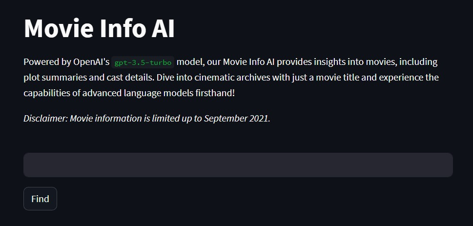

# Movie Info Finder

Discover detailed insights about movies using the power of OpenAI's `gpt-3.5-turbo` model. Whether you're curious about the plot, cast, or any other details, our assistant is here to help.

Check out the demo [here](https://movie-info-ai.streamlit.app/)



## Setup

### Running Locally

1. **Environment Variables**: Rename the `.env copy` file to `.env`.
   
2. **API Key**:
   - Obtain your OpenAI API key from [OpenAI Platform](https://platform.openai.com/account/api-keys) and input it into the `.env` file.

3. **Requirements**: Install the necessary packages using:
   ```
   pip install -r requirements.txt
   ```

### Running on Streamlit

1. **Secrets**: Rename the `secrets.toml copy` file inside the `.streamlit` folder to `secrets.toml`.

2. **API Key**:
   - Obtain your OpenAI API key from [OpenAI Platform](https://platform.openai.com/account/api-keys) and input it into the `secrets.toml` file.

3. **Requirements**: Install the necessary packages using:
   ```
   pip install -r requirements.txt
   ```

## Running the App

### Locally

To run the app locally, use the following command:

```
python movie_info_finder.py
```

### Streamlit

To run the app on Streamlit, use:

```
streamlit run movie_info_finder.py
```

## Acknowledgments

This project was inspired and developed by following the ActiveLoop tutorial on [Building Applications Powered by LLMs with LangChain](https://learn.activeloop.ai/courses/take/langchain/multimedia/46317658-building-applications-powered-by-llms-with-langchain).